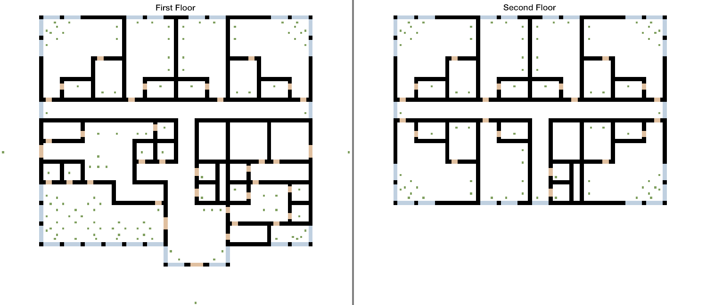

dataset-hotel-simulation
=================================

Results of a [DesignDEVS](http://www.autodeskresearch.com/projects/designdevs) [Simple Hotel Simulation](https://git.autodesk.com/research-ee/designDEVS-hotel-simulation)

The simulation and data was used in these publications:

- [Towards Voxel-Based Algorithms for Building Performance Simulation](http://www.autodeskresearch.com/publications/voxelbasedbps)
- [Towards Visualization of Simulated Occupants and their Interactions with Buildings at Multiple Time Scales](http://www.autodeskresearch.com/publications/multitimescales)

## Building Dataset
To populate a [MongoDB](http://www.mongodb.org/) or [TingoDB](http://www.tingodb.com/) with the data, follow these steps:

1. (Optional) If you want to use MongoDB, make sure [MongoDB](http://www.mongodb.org/) is installed
2. Edit configuration in package.json
3. Install all the required packages
> npm install
4. Run the db_import.js script
> npm start